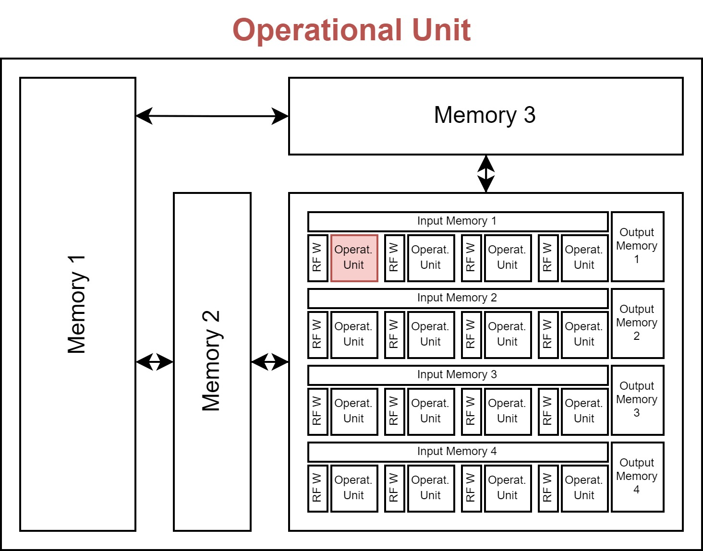
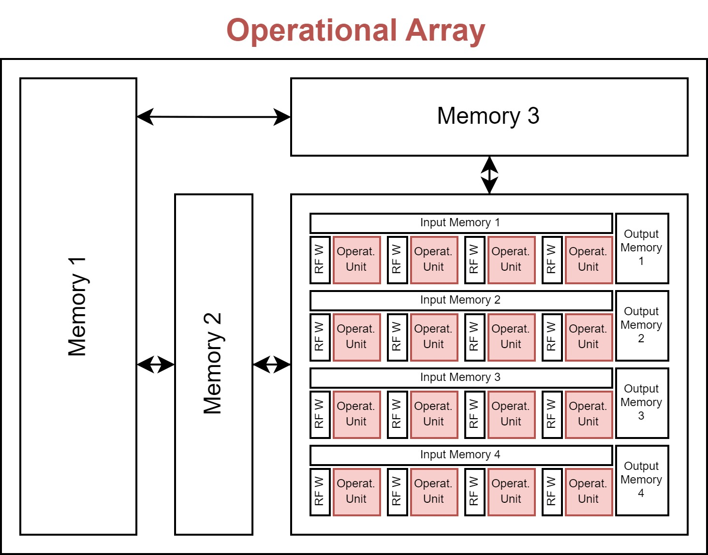
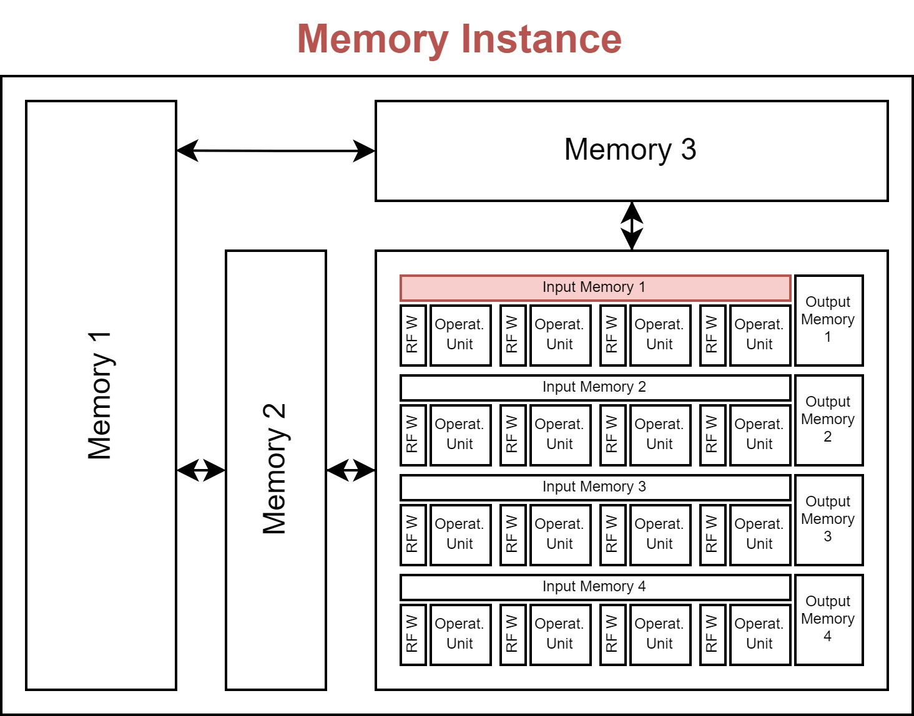
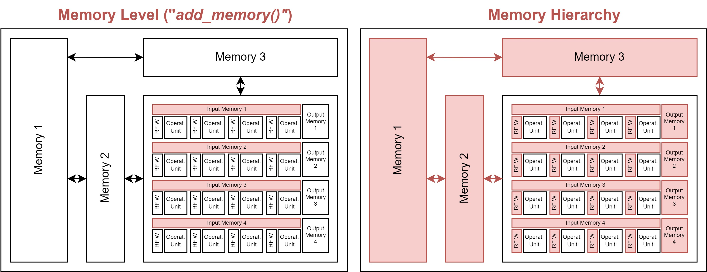
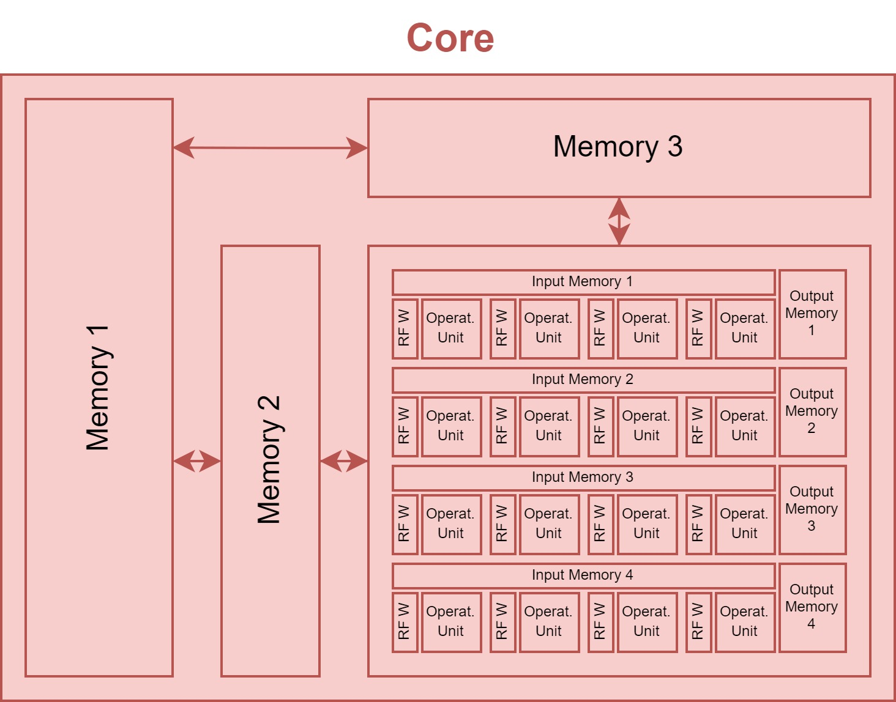
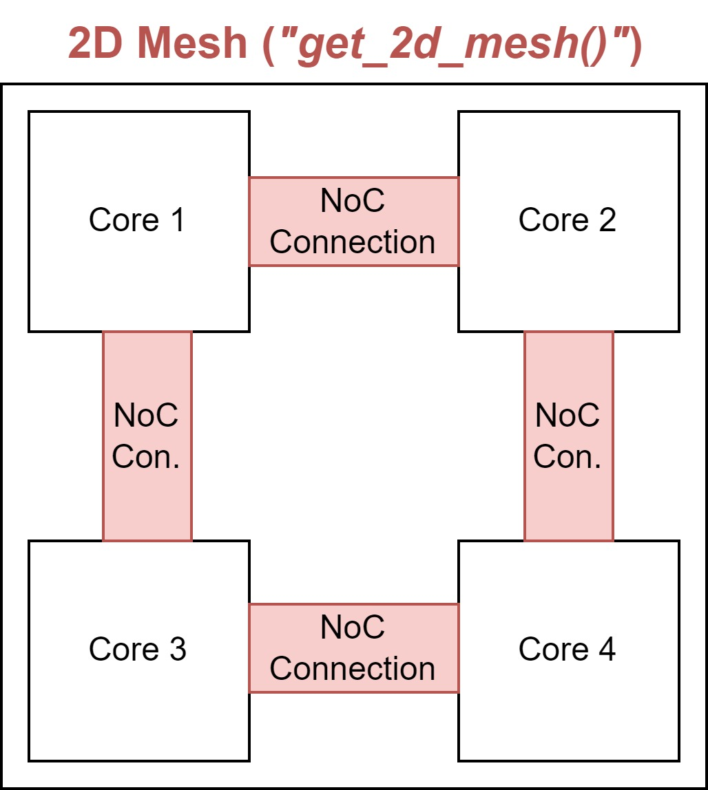
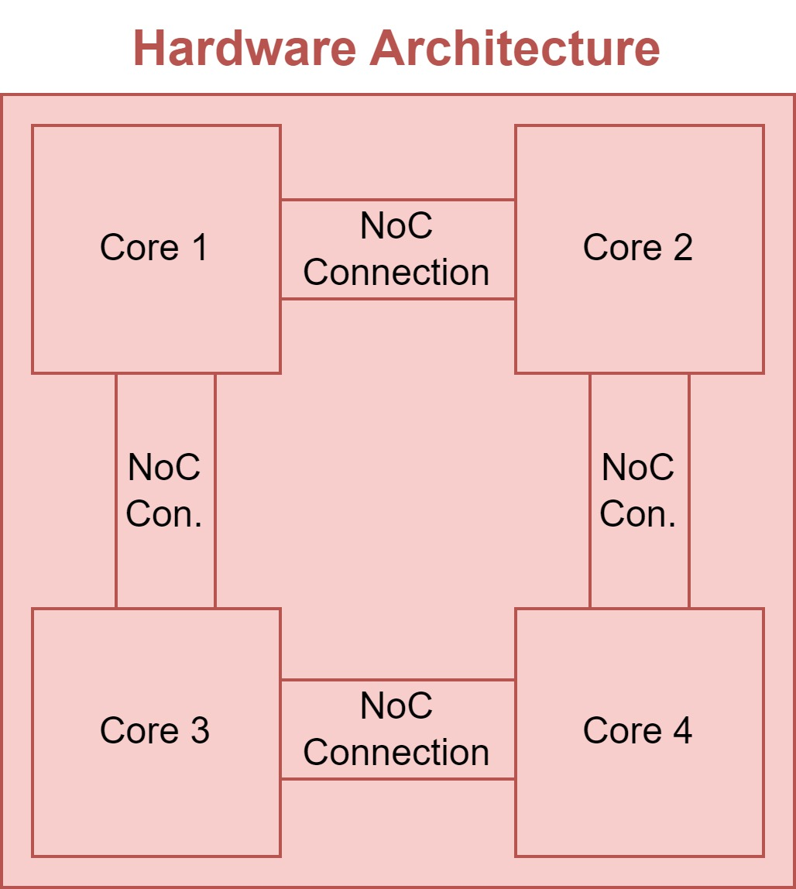

Hardware Architecture
=====================

In this section we introduce the general concept of how HW accelerators are modelled within Stream and the different well-known accelerators we provide as examples. We start from the smallest building block defined in Stream and work our way up towards an accelerator.

Operational Unit
----------------

Accelerating inference of a NN requires execution of multiplications and summations (accumulations) across multiple intermediate data (activations) using trained parameters (weights). The operational unit, typically a Multiplier, executes the multiplication of two data elements, typically an activation and a weight. 

The operational unit object has following attributes:

* **input_precision**: List of input operand (data) precision in number of bits for each input operand (typically 2 for Multiplier).
* **output_precision**: The bit precision of the operation's output.
* **energy_cost**: Energy of executing a single multiplication.
* **area**: The HW area overhead of a single multiplier.

Operational Array
-----------------

Inferencing a NN typically requires millions of operations, and an accelerator typically includes an array of operational units that can execute these operations. This can speed significantly up the computations, as well as increase energy efficiency which is covered later.

The array has multiple dimensions, each with a size. The importance of these dimensions is explained in the introduction of the memory hierarchy.

The operational array object has:

* **operational_unit**: The operational unit from which the array is built.
* **dimensions**: The dimensions of the array. This should be defined as a dict, with the keys being the identifier of each dimension of the array (typically 'D1', 'D2, ...) and the values being the size of this dimension (i.e. the size of the array along that dimension).

Memory Instance
---------------

In order to store the different activations and weights used for the computations in the operational array, different memory instances are attached in a hierarchical fashion. The instances define how big each memory is in terms of capacity and area overhead, what the cost of writing and reading from these memories is, what it's bandwidth is, and how many read/write/read-write ports it includes.

The memory instance object has:

* **name**: A name for the instance
* **size**: The memory size in bits.
* **r_bw/w_bw**: A read and write bandwidth in number of bits per cycle.
* **r_cost/w_cost**: A read and write energy cost.
* **area**: Area overhead of the instance.
* **r_port/w_port/rw_port**: The number of read/write/read-write ports the instance has available.
* **latency**: The latency of an access in number of cycles.

Memory Hierarchy
----------------

Besides knowing what the specs of each memory instance are, the memory hierarchy encodes information with respect to the interconnection of the memories to the operational array, and to the other memory instances. 
This interconnection is achieved through multiple calls to the `add_memory()`, where the first call(s) adds the first level of memories, which connects to the operational array, and later calls connect to the lower memory levels. This builds a hierarchy of memories.

To know if the memory should connect to the operational array or another lower memory level, it needs to know which data will be stored within the memories. To decouple the algorithmic side from the hardware side, this is achieved through the concept of 'memory operands' (as opposed to 'algorithmic operands which are typicall the I/O activations and weights W). You can think of the memory operands as virtual operands, which will later be linked to the actual algorithmic operands in the mapping file through the `memory_operand_links` attribute.

Similarly to how the operational unit can be unrolled (forming an operational array), the memories can also be unrolled, where each memory accompanies either a single operational unit or all the operational units in one or more dimensions of the operational array. This is encoded through the `served_dimensions` attribute, which specifies if a single memory instance of this memory level serves all operational units in that dimension. This should be a set of one-hot-encoded tuples.

Lastly, the different read/write/read-write ports a memory instance has, are assigned to the different data movevements possible in the hierarchy. There are four types of data movements in a hierarchy: from high (*fh*), to high (*th*), from low (*fl*), to low (*tl*). At the time of writing, these can be manually linked to one of the read/write/read-write ports through the following syntax: `{port_type}_port_{port_number}`, *port_type* being *r*, *w* or *rw* and *port_number* equal to the port number, starting from 1, which allows to allocate multiple ports of the same type. Alternatively, these are automatically generated as a default if not probided to the `add_memory()` call.

Internally, the MemoryHierarchy object extends the `NetworkX DiGraph <https://networkx.org/documentation/stable/reference/classes/digraph.html>`_ object, so its methods are available. 

The memory hierarchy object includes:

* **operational_array**: The operational array to which this memory hierarchy will connect. This is required to correctly infer the interconnection through the operational array's dimensions. Through the `add_memory()` calls it adds a new MemoryLevel to the graph. This requires for each call a:

* **memory_instance**: A MemoryInstance object you are adding to the hierarchy.
* **operands**: The virtual memory operands this MemoryLevel stores.
* **port_alloc**: The directionality of the memory instance's different ports, as described above.
* **served_dimensions**: The different dimensions that this memory level will serve, as described above.

Core
----

The operational array and the memory hierarchy together form a core of the accelerator.

The core object includes:

* **id**: The id of this core.
* **operational_array**: The operational array of this core.
* **memory_hierarchy**: The memory hierarchy of this core.
* **dataflows**: The possible spatial dataflows of this core.

2D Mesh
-------

By calling the function `get_2d_mesh()`, a 2D mesh will be created to connect the different cores within an hardware architecture. Each core is connected to its N, E, S, W neighbour.

The `get_2d_mesh()` function includes:

* **cores**: List of core objects.
* **nb_rows**: The number of rows in the 2D mesh.
* **nb_cols**: The number of columns in the 2D mesh.
* **bandwidth**: The bandwidth of each created directional link in bits per clock cycle.
* **unit_energy_cost**: The unit energy cost of having a communication-link active. This does not include the involved memory read/writes.
* **pooling_core**: If provided, the pooling core that is added.
* **simd_core**: If provided, the simd core that is added.
* **offchip_core**: If provided, the offchip core that is added.

HW Accelerator Model
--------------------

Multiple cores are combined together into the HW Accelerator, which is the main object modelling the HW behaviour.

The accelerator object includes:

* **name**: A user-defined name for this accelerator.
* **cores**: The cores comprised within the accelerator (DiGraph object).
* **offchip_core_id**: An offchip core with a shared memory across cores.

Modelled examples
-----------------

Several examples about how to model the hardware architectures in Stream can be found `here <https://github.com/KULeuven-MICAS/stream/tree/master/stream/inputs/examples/hardware>`_.