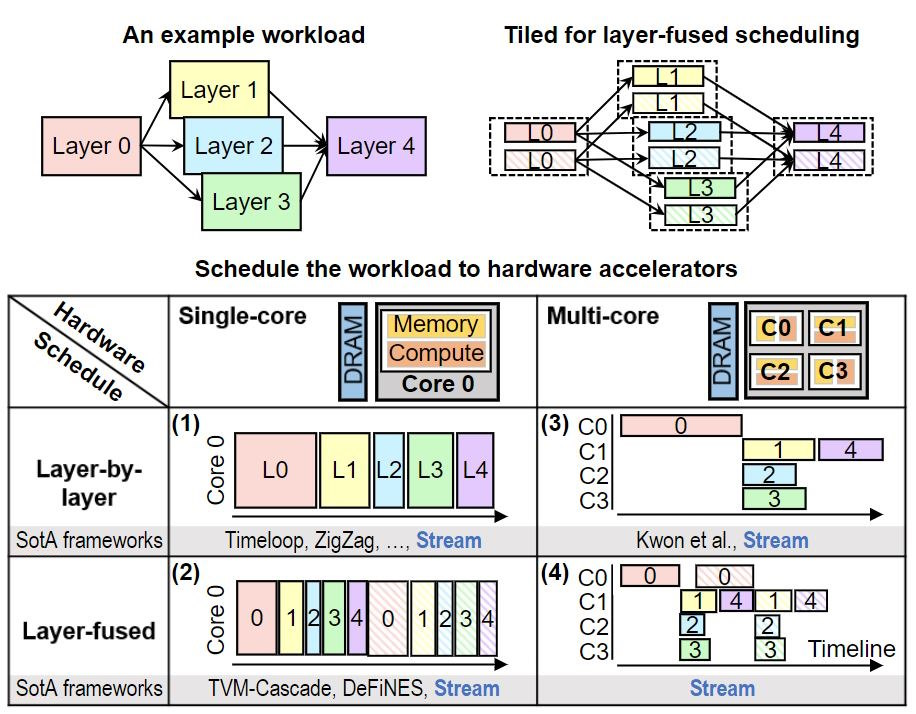

.. Stream documentation master file, created by
   sphinx-quickstart on Thu 18 Aug 10:43:21 2023.
   You can adapt this file completely to your liking, but it should at least
   contain the root `toctree` directive.

Welcome to Stream's documentation!
==================================

Stream is a HW architecture-mapping design space exploration (DSE) framework for multi-core
deep learning accelerators. The mapping can be explored at different granularities,
ranging from classical layer-by-layer processing to fine-grained layer-fused processing.
Stream builds on top of the ZigZag DSE framework, found `here <https://kuleuven-micas.github.io/zigzag/>`_.

While the ZigZag framework was built to explore mappings of DNN workloads on single-core architecture in a layer-by-layer fashion, Stream extends this idea by two dimensions (see images below). Firstly, it allows the exploration of multi-core architectures as well. Secondly, Stream introduces layer-fused execution of DNN workloads while ZigZag is limited to layer-by-layer execution. Besides this, Stream allows to perform a design space exploration of workloads which consists of many layers. By employing an genetic algorithm, Stream finds optimal layer-core allocations of these multi-layer workloads on multi-core architectures.

`This video <https://www.youtube.com/watch?v=9LVIVy1_ukw>`_ provides you with an introduction of Stream. You can read in `one of our publications <https://kuleuven-micas.github.io/stream/publications.html#extension-to-support-multi-core-layer-fused-scheduling>`_ about the advantages of the support of layer-fused processing and (heterogeneous) multi-core systems.

.. toctree::
   :maxdepth: 2
   :caption: Contents:

   installation
   getting-started
   user-guide
   future
   contribute
   publications

Indices and tables
==================

* :ref:`genindex`
* :ref:`modindex`
* :ref:`search`
