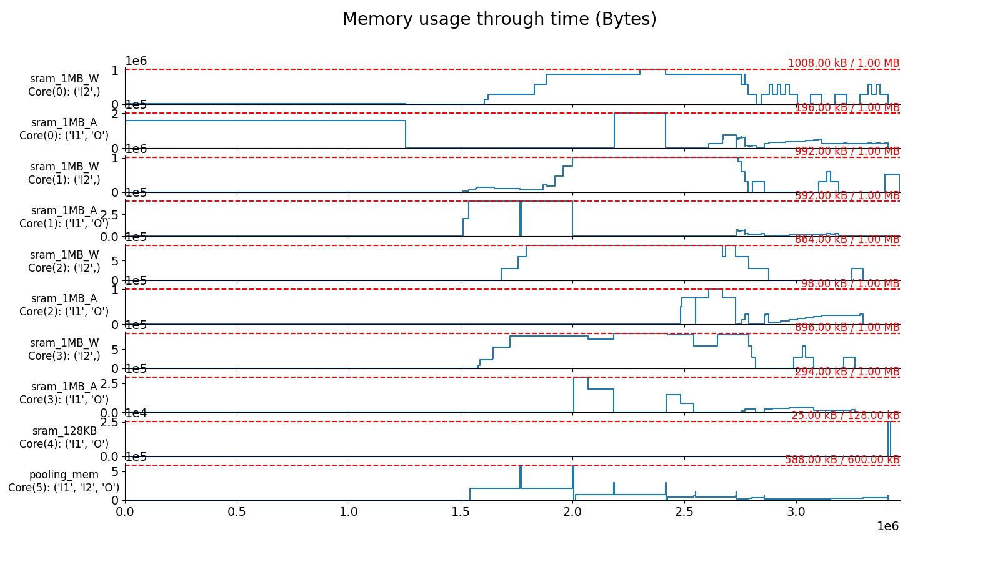

# Outputs

After the execution of all the stages has finished
(`scme, _ = mainstage.run()`), the user has access to a variety of
optimal Stream Cost Model Evaluations (SCMEs) produced by the genetic
algortihm of Stream (i.e. Hall of fame). Each of these SCMEs offers a
layer-core allocation with an unique trade-off due to the usage of a
NSGA-II genetic algorithm.

## Printing the attributs of a specific SCME

The user can select one of these SCMEs by using selecting a specific
SCME with the command `scme = scme[0]`. Another SCME can be selected by
using a different index than `0`.

After selecting a SCME with the previous command, the attributes of the
SCME can be printed to the terminal with the following instructions:

``` python
from pprint import pprint
pprint(vars(scme))
```

After a specific SCME is selected, the user can generate a variety of
outputs which will be introduced in the following. If you are using the
example provided in [this
file](https://github.com/KULeuven-MICAS/stream/blob/master/main_stream_layer_splitting.py),
then all the introduced outputs are saved in the `outputs` folder in
your repo.

### Pickle file of SCME

By using the `save_scme()` function from `stream.utils`, the user can
save a specific SCME in a pickle file for later investigations. The SCME
includes all attributes of the `StreamCostModelEvaluation` in the
[cost_model.py
file](https://github.com/KULeuven-MICAS/stream/blob/master/stream/classes/cost_model/cost_model.py).
Examples for these attributes are the latency or the maximal memory
usage of layer-core allocation underling to the SCME.

### Schedule visualization

Perfetto visualization ====================

The schedule of a specific SCME can be saved in a Perfetto json file by
calling `convert_scme_to_perfetto_json()` from
`stream.visualization.perfetto`. The saved file can be opened at
<https://ui.perfetto.dev> and the different parts of the schedule can be
further investigated.

## PNG visualization

By using the `plot_timeline_brokenaxes()` function from
`stream.visualization.schedule`, a portion of the entire schedule can be
visualized to a `png` file.

### Memory usage visualization

The function `plot_memory_usage()` from
`stream.visualization.memory_usage` allows to save a visualization of
the memory usage of a specific SCME in a `png` file. An example can look
like the following diagram:

{width="900px"}

The diagram shows the utilization of the on-chip SRAM memories of the
different cores in the hardware architecture for a specific SCME. In
this example each core of core 0 to core 3 has two SRAM memories. One of
the two SRAM memories (e.g. `sram_1MB_W`) holds the weights for the
processing in the core. The other SRAM memory of each core (e.g.
`sram_1MB_A`) holds the activations (i.e. input and output activations)
of the compuations in the core. In this example, core 4 and core 5 have
only one memory to store all relevant data. The plots for each of these
memories show how much they are utilized during the processing of the
workload.
