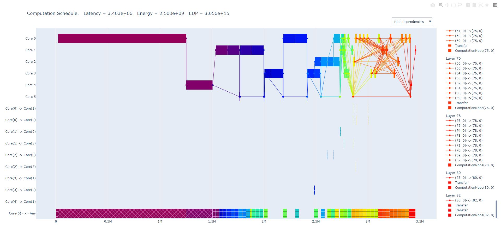
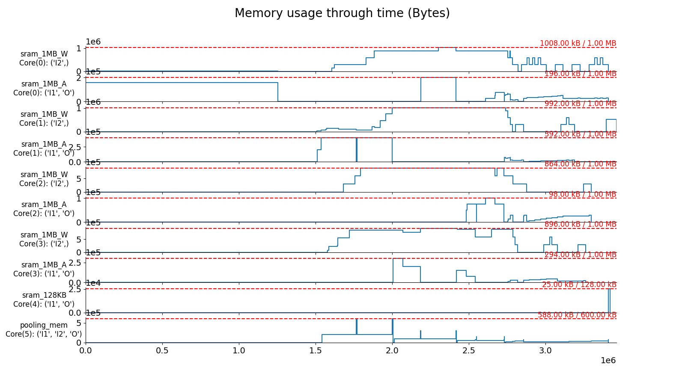

=======
Outputs
=======

After the execution of all the stages has finished (``scme, _ = mainstage.run()``), the user has access to a variety of optimal Stream Cost Model Evaluations (SCMEs) produced by the genetic algortihm of Stream (i.e. Hall of fame). Each of these SCMEs offers a layer-core allocation with an unique trade-off due to the usage of a NSGA-II genetic algorithm.

Printing the attributs of a specific SCME
=========================================

The user can select one of these SCMEs by using selecting a specific SCME with the command ``scme = scme[0]``. Another SCME can be selected by using a different index than ``0``.

After selecting a SCME with the previous command, the attributes of the SCME can be printed to the terminal with the following instructions:

.. code-block:: python

    from pprint import pprint
    pprint(vars(scme))

After a specific SCME is selected, the user can generate a variety of outputs which will be introduced in the following. If you are using the example provided in `this file <https://github.com/KULeuven-MICAS/stream/blob/master/main_stream_layer_splitting.py>`_, then all the introduced outputs are saved in the ``outputs`` folder in your repo.

Pickle file of SCME
-------------------

By using the ``save_scme()`` function from ``stream.utils``, the user can save a specific SCME in a pickle file for later investigations. The SCME includes all attributes of the ``StreamCostModelEvaluation`` in the `cost_model.py file <https://github.com/KULeuven-MICAS/stream/blob/master/stream/classes/cost_model/cost_model.py>`_. Examples for these attributes are the latency or the maximal memory usage of layer-core allocation underling to the SCME.

Schedule visualization
----------------------

Plotly visualization
====================

The schedule of a specific SCME can be saved in a Plotly-html file by calling ``visualize_timeline_plotly()`` from ``stream.visualization.schedule``. The saved file can be opened in a web browser and the different parts of the schedule can be further investigated. The following image shows an example of this visualization:

The first six lines of the diagram (``Core 0`` to ``Core 5``) show the usage of the different cores for this specific SCME. The following nine lines (``Core(0) -> Core(1)`` to ``Core(4) -> Core(1)``) show the communication (i.e. data exchange) between the different processing cores. The last line of the diagram (``Core(6) <-> Any``) shows the utilization of the port to the off-chip memory (i.e. ``Core(6)``).

An example of such an interactive Plotly visualization can be accessed `through this link <interactive-plotly-visualization.html>`_.

PNG visualization
=================

By using the ``plot_timeline_brokenaxes()`` function from ``stream.visualization.schedule``, a similar visualization than the Plotly schedule can be saved in a ``png`` file.

Memory usage visualization
--------------------------

The function ``plot_memory_usage()`` from ``stream.visualization.memory_usage`` allows to save a visualization of the memory usage of a specific SCME in a ``png`` file. An example can look like the following diagram:

The diagram shows the utilization of the on-chip SRAM memories of the different cores in the hardware architecture for a specific SCME. In this example each core of core 0 to core 3 has two SRAM memories. One of the two SRAM memories (e.g. ``sram_1MB_W``) holds the weights for the processing in the core. The other SRAM memory of each core (e.g. ``sram_1MB_A``) holds the activations (i.e. input and output activations) of the compuations in the core. In this example, core 4 and core 5 have only one memory to store all relevant data. The plots for each of these memories show how much they are utilized during the processing of the workload.
