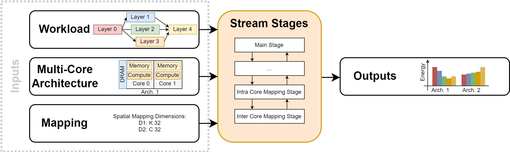

# User Guide

Stream's mapping flow is built from a few well-defined inputs and a modular pipeline. The pages below explain each piece as it works today.

## Inputs

- [Workload](workload.md) - how Stream reads an ONNX model and turns it into a computation graph (supported operators, shape inference, weight handling).
- [Hardware](hardware.md) - how an accelerator is described as a system of heterogeneous cores: the accelerator file, core files, memory hierarchy, and interconnect.
- [Mapping](mapping.md) - how operators are matched to cores and split across them, either auto-generated or hand-written.

## Pipeline & outputs

- [Stages](stages.md) - the sequence of stages that parse, tile, cost, allocate (MILP), and estimate memory, and how to add your own.
- [Outputs](outputs.md) - the latency/schedule results, summary files, visualizations, and typed IR.

## Driving Stream from an agent

- [Using Stream with an AI agent](ai-agents.md) - the in-repo skills, the MCP server, and the IR models for programmatic/structured access.

For design rationale, see the [publications](publications.md) page or read the [source](https://github.com/KULeuven-MICAS/stream_aie) on GitHub.
