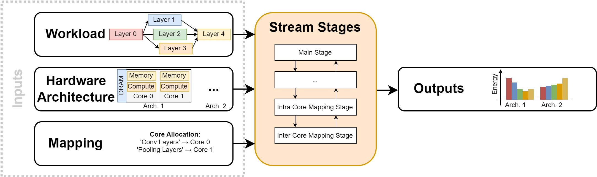

==========
User Guide
==========

Generally, the Stream framework can be divided into five big building blocks. The following documents provide more information regarding the building blocks of Stream. More information about how Stream works internally can be found on the :doc:`publications` page and in the `code <https://github.com/KULeuven-MICAS/stream>`_of the project.

.. toctree::
   :maxdepth: 1

   workload
   hardware
   mapping
   stages
   outputs