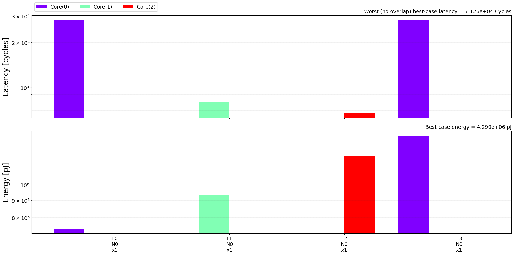
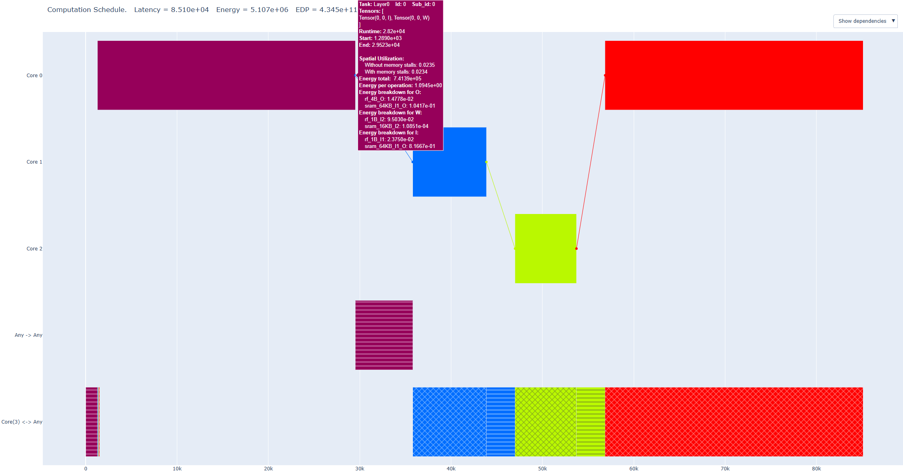
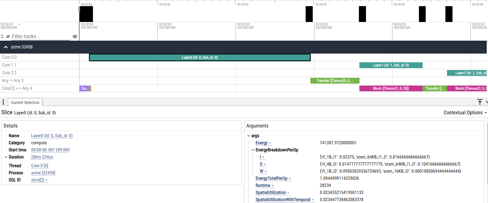
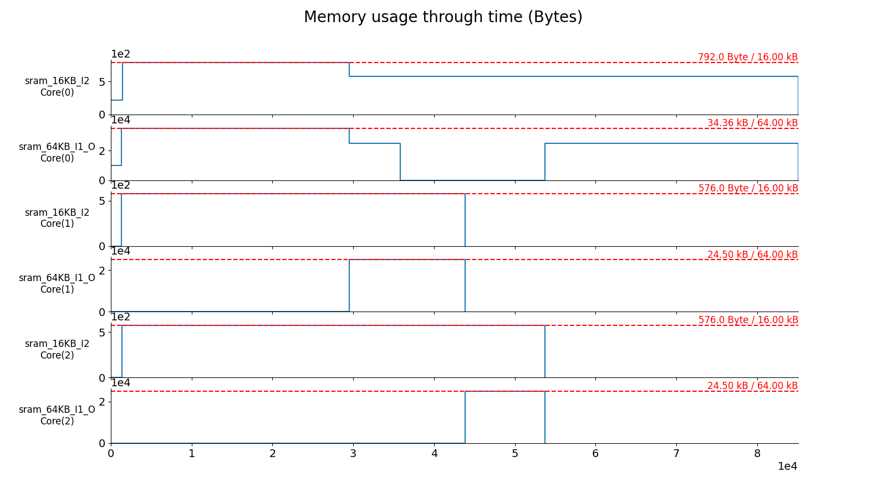

# Lab 1: First Run of the Stream Framework

## Objective
The goal of this lab is to perform the first run of the Stream framework. You will execute a workload consisting of four back-to-back convolutional layers, onto a heterogeneous dataflow accelerator (HDA) architecture consisting of three distinct accelerator cores interconnected with a single bus with an offchip memory attached. Stream allows flexible partitioning of the workload onto the different cores of the HDA. In this first run, we keep it simple by mapping a single layer to a single core and executing them sequentially (layer-by-layer).

## Setup
1. Ensure you have installed the requirements in `requirements.txt`.
2. Make sure you are in the base directory, as `lab1/main.py` automatically inserts the working directory into PATH which is needed for the Stream imports.

## Inputs
There are three main inputs defined in the `inputs/` folder:
1. **Workload**: Four back-to-back convolutional layers. The layer names are `Layer0`, `Layer1`, etc. You can use [Netron](https://netron.app) to visualize the model.
2. **Hardware**: A sample accelerator is encoded in `hda_bus.yaml`. There are three computing cores, `accelerator1.yaml` through `accelerator3.yaml`. These cores are defined using the ZigZag architecture definition (more information on the ZigZag architecture representation can be found [here](https://kuleuven-micas.github.io/zigzag/hardware.html)). Additionally, there is an `offchip_core` field which specifies the description of the offchip core. This offchip core also uses the ZigZag description, of which only the memory information is used (as no computations can be allocated to the offchip core). The cores are interconnected using the `core_connectivity` field of the HDA description. This specifies on each line a communication channel between two or more cores. A link is automatically added from the offchip core to the different compute cores.
3. **Mapping**: The mapping specifies for the `Layer0`-`Layer3` which core they can be allocated to. In this first run, we fix the allocation of the layers to a single core to get a baseline of the execution.

## Running the Experiment
The main file defines the path to the three main inputs and parses out some more names and an `experiment_id` to save the outputs. It specifies multiple variables for the API call. An important one is `mode`, which should be `lbl` for layer-by-layer execution, or `fused` for layer-fused execution.

Then, the Stream API is called:

```python
if not os.path.exists(scme_path):
    scme = optimize_allocation_ga(
        hardware=accelerator,
        workload=workload_path,
        mapping=mapping_path,
        mode=mode,
        layer_stacks=None,
        nb_ga_generations=nb_ga_generations,
        nb_ga_individuals=nb_ga_individuals,
        experiment_id=experiment_id,
        output_path="lab1/outputs",
        skip_if_exists=True,
    )
else:
    scme = pickle_load(scme_path)
```
`optimize_allocation_ga` uses a genetic algorithm (GA) to optimize the workload allocation in case it's not fixed (Note that here it is fixed so this engine will not be used). A common practice is to cache the saved Stream cost model evaluation (SCME) in a pickle file, and reuse this to speed up different visualizations/attribute inspection.

Now, run the main file:
```bash
python lab1/main.py
```

As the mapping of the layers onto the cores is fixed, this run will first extract the hardware cost of each layer on the core they are allocated to using ZigZag, and then do a single COALA (Stream's cost model) evaluation to get the multi-core overheads.

## Outputs
The results of the experiment will be saved in the `outputs/` folder under the `experiment_id`.

- `cost_lut.png` visualizes the ZigZag layer-core costs. Because the workload allocation is fixed here, the cost of each layer is only extracted for the core it's allocated to.

- `schedule.html` is a Plotly-based visualization of the obtained schedule through time on the different computation and communication resources of the HDA. You can download this and view it in your favourite web browser (Firefox). 


- `schedule.json` is a conversion of the schedule to json format for usage with the [Perfetto](https://ui.perfetto.dev/) visualization tool. This visualization scales better for very large workload graphs with a lot of nodes. Note that the colors here are not the same as in the Plotly visualization, as we don't have control over this.


- `memory.png` visualizes the memory usage on the different Core memories through time. This can help to identify memories that could benefit from increased capacity.


## Questions & Answers

- Take a look inside the Stream API call in `stream/api.py`. Do you understand the meaning of all the defined stages and all arguments passed to these stages?
    > <details>
    > <summary>Answer</summary>
    >     
    > You can read more information on the different stages [here](https://kuleuven-micas.github.io/stream/stages.html). Each stage performs a different function, ranging from parsing inputs to generating the hardware cost of the different layers using ZigZag and calling the allocation optimization engines.
    >   
    > </details>

- What is `nb_ga_generations` and `nb_ga_individuals`? Are they used here?
    > <details>
    > <summary>Answer</summary>
    >     
    > These are the number of generations of and the number of individuals in each generation of the genetic algorithm (GA). The GA is one of the optimization engines that can help find a better workload allocation of the layers onto the computation cores. As the mapping is fixed, the GA doesn't actually optimize anything here, and will be bypassed. However, the API call requires them as an argument.
    >   
    > </details>

- Why is there both a `allocation_is_fixed` field and a `core_allocation` field? Can't you infer one from the other?
    > <details>
    > <summary>Answer</summary>
    > 
    > The reason both fields are required is that it is also possible to distribute a single layer across multiple cores in a fixed manner. In this scenario, `allocation_is_fixed` will be `True` and there will be more than one core specified in `core_allocation`.
    > 
    > </details>

- Analyze the visualization of the schedule at `lab1/outputs/hda_bus-3_convs-lbl-genetic_algorithm/schedule.html`. What is the total latency? Which resources do you see vertically?
    > <details>
    > <summary>Answer</summary>
    >     
    > The total latency is displayed on the top: 8.510e4. There are three computation resources: `Core 0`, `Core 1` and `Core 2`. There are two communication resources: `Any -> Any` which represents the bus connecting the three cores and `Core(3) <-> Any` which represents the offchip link (Core 3 is the offchip core).
    >   
    > </details>

- Which layer has the highest energy consumption?
    > <details>
    > <summary>Answer</summary>
    >     
    > There are two ways to get the answer to this question. One is to look at the `cost_lut.png`, which shows the output of the ZigZag performance estimation. This shows that `Layer 3`, allocated to `Core 0`, has the highest energy consumption.
    > 
    > The second approach uses the Plotly visualization. When hovering over the different layer rectangles, you can see the `Energy total` displayed, which is the highest for `Layer 3`.
    > 
    > </details>

- What are the arched boxes in the `Core(3) <-> Any` communication link?
    > <details>
    > <summary>Answer</summary>
    >     
    > There are two types of tasks that can be assigned to communication links: 1. Transfers and 2. Blocks. Transfers are simple: they use a communication link to transfer a tensor from one core's memory to another core's memory (if there are multiple hops needed a task is scheduled on each link). 
    > 
    > Blocks are a bit more complex. Blocks are added to a communication link whenever a layer (or smaller part of a layer) is to be scheduled on a core whose memory is insufficient to store all of the tensors needed for the execution. In that case, there is further tiling needed of the tensors. To facilitate this, the offchip memory is added as the highest level of memory for the ZigZag cost call. However, ZigZag's cost model is analytical, and we thus don't know the exact timing of the transfers of these tiles, we only know the average required bandwidth. That's why, in Stream, we 'block' the communication link with this average required bandwidth for the entire duration of the execution on the core. It's important to note that it is thus possible that multiple 'block' tasks are scheduled in parallel. If they are overlapping you will only see one of them in the visualization.
    >   
    > </details>